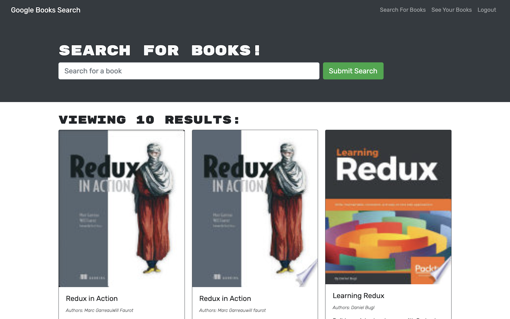
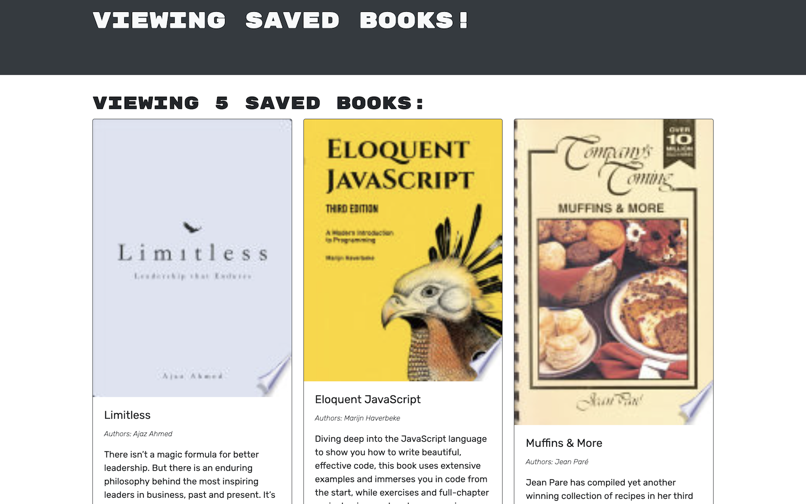

# Bukem

A Google Books Search Engine

## Deployment

Bukem has been deployed on Heroku [https://sl-bukem.herokuapp.com/](https://sl-bukem.herokuapp.com/)

## Technologies

- Mongoose (MongoDB & Mongo Atlas)
- Express
- React
- Node.js using:
- GraphQL (Apollo Express Server & Client)
- JSON Web Token

## Description

Bukem is a simple search engine utilising the Google Books API, allowing users to save books.

## What We Did

We were provided with a working (front and back-end) site built with a RESTful API. This was refactored to be a GraphQL API, using Apollo Server utilising typeDefs, resolvers, queries & mutations.

